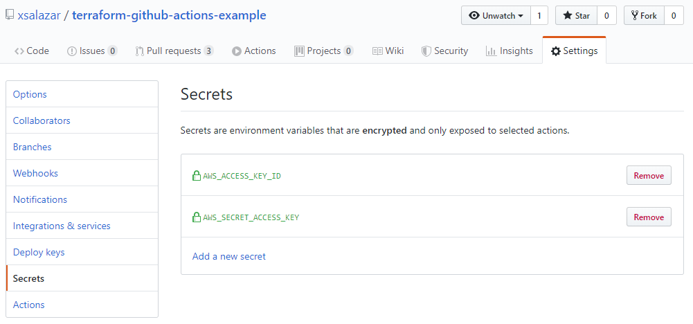
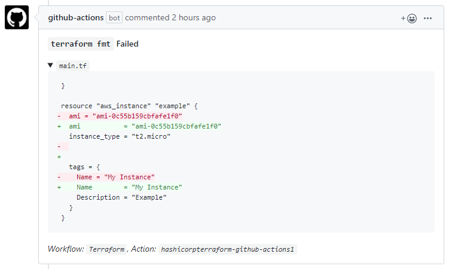
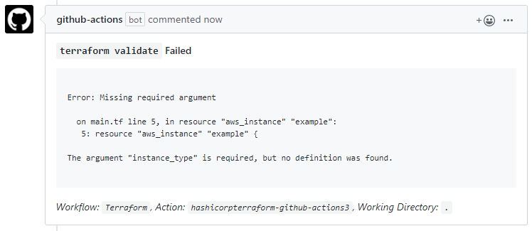

# Terraform GitHub Actions Examples
This repository is a set of small examples that show how to use the official [Terraform GitHub Actions](https://github.com/hashicorp/setup-terraform) to run on your personal repositories.

## Getting Started
The official Terraform documentation can be found [here](https://www.terraform.io/docs/github-actions/index.html)

### Setting up secrets
In order to run `terraform plan` or `terraform apply`, you will potentially need to setup credentials to allow for the workflow to properly communicate with any cloud providers you may be using. In this example, since I am setting up an AWS provider and creating an EC2 instance, I need to pass through AWS credentials.

You provision these per-repository. You can setup these secrets by going to the repository Settings > Secrets > Add new secret.

Once created, you can reference those secrets from the workflow by using `${{ secrets.AWS_ACCESS_KEY_ID }}` or `${{ secrets.AWS_SECRET_ACCESS_KEY }}`. This Action uses the [configure-aws-credentials](https://github.com/aws-actions/configure-aws-credentials) Action to set up the environment.

It is worth noting that `GITHUB_TOKEN` is [automatically provided](https://help.github.com/en/actions/automating-your-workflow-with-github-actions/authenticating-with-the-github_token) to workflows, and you do not need to manually set this up.

## Actions

### `terraform fmt`
You can see an example of this command being run in [this pull request](https://github.com/xsalazar/terraform-github-actions-example/pull/19).

### `terraform validate`
You can see an example of this command being run in [this pull request](https://github.com/xsalazar/terraform-github-actions-example/pull/21).

### `terraform plan`
You can see an example of this command being run in [this pull request](https://github.com/xsalazar/terraform-github-actions-example/pull/20). The plan output is too long to include here, but you can expand the output in the original comment.

